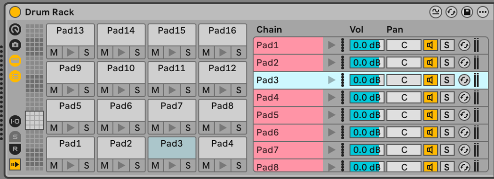

# Als2Bb Converter

A complete, production-ready converter for translating Ableton Live Drum Rack projects into 1010music Blackbox presets.

## Overview

This tool extracts samples, sequences, and settings from Ableton Live `.als` project files and converts them into Blackbox-compatible `.xml` preset files. It's specifically designed for **Drum Rack** workflows, supporting up to 16 pads with full parameter extraction.

## 🎯 Using the Ableton Template (Recommended)

**The easiest way to get started is to use the included Ableton template!**

We've included a ready-to-use Ableton Live template that emulates the Blackbox structure. This template provides the perfect starting point for creating projects that convert seamlessly to Blackbox presets.

### Template Structure

The template (`ableton_template/BB2ALS Template Project/BB2ALS Template.als`) is set up to mirror the Blackbox architecture:

- **16 Drum Rack Cells** = **16 Blackbox Sample Pads**
  - Each cell in the Drum Rack represents one Blackbox pad
  - Load your samples into Simplers within each cell
  - Configure slicing, envelopes, and other settings per pad

- **16 MIDI Tracks** = **16 Blackbox Sequences**
  - Tracks labeled "Seq1" through "Seq16" correspond to Blackbox sequences
  - Each track has 4 clip slots (A, B, C, D) representing sub-layers
  - Route MIDI from these tracks to the Drum Rack to trigger pads


*The template shows the 16 sequence tracks (Seq1-Seq16) and the Pads track with Drum Rack. Each sequence track has 4 clip slots (A-D) for sub-layers, and the Drum Rack contains 16 cells for your samples.*

### Getting Started with the Template

1. Open `ableton_template/BB2ALS Template Project/BB2ALS Template.als` in Ableton Live
2. Load your samples into the Drum Rack cells (each cell has a Simpler)
3. Configure your pad settings (slicing, envelopes, choke groups, etc.)
4. Create MIDI sequences in the Seq1-Seq16 tracks
5. Convert using the converter tool

See the [Quick Start](#quick-start) section below for conversion instructions.

## Features

### 🎯 Complete Drum Rack Support
- Extract all 16 drum rack pads from Ableton
- Map samples to Blackbox pads with accurate positioning
- Support for multiple Simplers per rack
- Automatic sample file copying and path resolution

### 🎵 Advanced Parameter Extraction
- **Sample Settings**: Start, end, loop points, sample length (from WAV headers)
- **Envelopes**: ADSR with accurate conversion
- **Beat Detection**: Automatic beat count calculation from sample duration and tempo
- **Clip Mode**: Intelligent detection for long samples (≥8 beats)
- **Loop Modes**: Supports both sampler and clip looping modes

### 🎹 MIDI Sequence Support
- Multi-layer sequences (up to 4 sub-layers per pad)
- Preserves note timing, velocity, and duration
- Supports quantized 16th note sequences
- Compatible with firmware 2.3+ format

### ✂️ Slicing Mode Support

The converter fully supports Ableton Simpler's slicing mode and converts it to Blackbox slicer pads:

- **Slice Detection**: Automatically detects when Simpler is in Slice mode
- **Slice Point Extraction**: Extracts slice markers from:
  - **Transient detection** (based on onset detection)
  - **Beat slicing** (aligned to beat grid)
  - **Region slicing** (user-defined regions)
  - **Manual slicing** (manually placed slice points)
- **Playback Settings**:
  - **Play-through mode**: When Simpler playback is set to "Through" or "Play Through", Blackbox playthrough is enabled
  - **Sync mode**: When Simpler warp is enabled, Blackbox sync is enabled
  - **Transpose**: Extracts and applies transpose settings from Simpler
- **Beat Count**: Automatically calculates beat count from sample length (same as clip/stem extraction)
- **Envelopes**: Uses the same envelope defaults as clip mode


*Example showing slicer mode with playthrough enabled. Note that all transients that are in the clip are being extracted as slice points.*

### 🎚️ Advanced Features
- **Choke Groups**: Automatic extraction and mapping (A-D groups)
- **Warp Detection**: Identifies time-stretched samples
- **Sample Rate Handling**: Works with 44.1kHz and 48kHz samples
- **Output Routing**: Properly routes to main output bus
- **Error Handling**: Comprehensive logging and graceful error recovery

## Origin & Development

> **This project started from [mkarla's Ableton_Blackbox converter](https://github.com/mkarla/Ableton_Blackbox) but has been completely rewritten from the ground up.**

### What Changed

The original script used a clip-based approach for Ableton Live 10/11. This version is a **complete rewrite** that:

- ✅ **Rewrote 90%+ of the codebase** (1,579 lines vs original 610)
- ✅ **Switched to Drum Rack architecture** (instead of clip-based)
- ✅ **Added multi-layer sequence support**
- ✅ **Implemented WAV file header reading** for accurate sample lengths
- ✅ **Added beat count calculation** from sample duration and tempo
- ✅ **Added full slicing mode support** with slice point extraction
- ✅ **Enhanced error handling** with safe navigation and detailed logging
- ✅ **Added comprehensive documentation** and workflow guides
- ✅ **Tested with Ableton Live 12.2/12.3**

While the core concepts of XML parsing and parameter extraction were inspired by the original, the implementation is fundamentally different and built for modern Ableton Live workflows.

## Requirements

- **Python 3.7+** (tested with Python 3.9+)
- **Ableton Live 10/11/12** project files (`.als` format)
- **1010music Blackbox** firmware 2.3+ (for sequence format compatibility)

All dependencies are standard Python libraries (no external packages required):
- `xml.etree.ElementTree`
- `argparse`
- `gzip`
- `os`, `shutil`
- `struct` (for WAV file reading)

## Quick Start

### Basic Usage

```bash
python3 code/xml_read_v2.py -i "path/to/your/project.als" -o "output/preset_name"
```

### Options

- `-i, --input`: Path to your Ableton Live `.als` file
- `-o, --output`: Output directory name (will create folder with preset.xml and samples)
- `-v, --verbose`: Enable verbose logging (useful for debugging)
- `-h, --help`: Show help message

### Example

```bash
cd ableton_blackbox
python3 code/xml_read_v2.py -i "../Ableton Files/My Project.als" -o "../Presets/My_Preset"
```

This will create:
```
Presets/My_Preset/
├── preset.xml
└── (all sample files)
```

## Project Structure

Your Ableton project should be set up as follows:

1. **Track 1**: Drum Rack with up to 16 Simplers (one per pad)
2. **Tracks 2-17**: MIDI tracks for sequences (one per pad, optional)

**💡 Tip**: Use the included template (`ableton_template/BB2ALS Template Project/BB2ALS Template.als`) which already has this structure set up!

### Important: Chain Order

⚠️ **The converter uses chain order to determine pad positions**, not MIDI note assignments.

**Before converting**, arrange your chains in the Drum Rack chain list to match your desired pad layout:
- Chain 0 → Blackbox Pad 1 (bottom-left)
- Chain 1 → Blackbox Pad 2
- Chain 2 → Blackbox Pad 3
- Chain 3 → Blackbox Pad 4 (bottom-right)
- Chain 4 → Blackbox Pad 5
- ... and so on

**⚠️ Critical Warning**: The order of chains can get jumbled in Ableton, which will completely mess up your conversion! Always verify the chain order before converting.

**✅ Correct Order:**
Chains should be in sequential order (0, 1, 2, 3, ...) matching the Blackbox pad layout:



*Correct chain order: chains are numbered sequentially and match the Blackbox pad layout.*

**❌ Bad Order (Jammed):**
If chains are out of order or jumbled, your pads will be mapped incorrectly:


*Bad chain order: chains are jumbled and out of sequence. This will cause incorrect pad mapping in the conversion!*

**How to Fix Chain Order:**
1. Open the Drum Rack device view
2. Check the chain list order
3. Drag chains to reorder them if needed
4. Verify the order matches your intended pad layout before converting

See [docs/WORKFLOWS.md](docs/WORKFLOWS.md) for complete details on pad mapping and workflows.

### Output Routing for MIDI Sequences

For MIDI sequences to work correctly, you need to configure output routing in Ableton. The routing determines which Blackbox mode the sequences will use:

**Default (Pads Mode):**
By default, MIDI tracks route to the whole Drum Rack, which results in **Pads mode** in Blackbox:


*Default output routing routes to the entire Drum Rack, resulting in Pads mode conversion.*

**Keys Mode:**
To enable **Keys mode** (for triggering specific pads with sequences), change the output routing to target a specific chain/branch:


*Configure output routing to change sequence to pad mapping and enable Keys mode for proper MIDI sequence conversion.*

**External MIDI Mode:**
For external MIDI routing:


*Output routing settings for changing to external MIDI mode.*

## Blackbox Pad Layout

The Blackbox uses a 4×4 pad grid. **Pads are numbered 1-16, starting from bottom-left:**
```
Row 0 (top):     13  14  15  16
Row 1:           9   10  11  12
Row 2:           5   6   7   8
Row 3 (bottom):  1   2   3   4
```

**Note**: The code uses 0-15 internally, but Blackbox displays pads as 1-16.

## What Gets Converted

### ✅ Successfully Extracted
- Sample files (WAV format)
- Sample start/end points
- Loop start/end points
- ADSR envelope settings
- Beat counts (calculated from duration and tempo)
- Clip mode (for samples ≥8 beats)
- **Slicing mode**:
  - Slice points (transient, beat, region, or manual)
  - Play-through mode (from Simpler playback settings)
  - Sync mode (from Simpler warp settings)
  - Transpose settings
  - Beat count calculation
- Choke groups (A-D)
- MIDI sequences with multiple sub-layers
- Tempo
- Output routing

### ⚠️ Limitations
- **Pad mapping**: Uses chain order, not MIDI note assignments (see above)
- **Warped samples**: Beat counts may not account for time-stretching
- **Grouped devices**: Doesn't handle grouped Simplers/Samplers
- **Sample format**: Only WAV files are supported

## Documentation

- **[QUICKSTART.md](QUICKSTART.md)** - Step-by-step guide for first-time users
- **[docs/WORKFLOWS.md](docs/WORKFLOWS.md)** - Complete workflows guide
- **[docs/DRUM_RACK_WORKFLOW.md](docs/DRUM_RACK_WORKFLOW.md)** - Detailed Drum Rack workflow
- **[docs/SEQUENCE_TIMING_WORKFLOW.md](docs/SEQUENCE_TIMING_WORKFLOW.md)** - Detailed timing and quantization rules
- **[docs/BLACKBOX_TECHNICAL_REFERENCE.md](docs/BLACKBOX_TECHNICAL_REFERENCE.md)** - Blackbox XML structure reference

## Contributing

This is an active project! If you find bugs or have feature requests:

1. Check [docs/WORKFLOWS.md](docs/WORKFLOWS.md) troubleshooting section first
2. Open an issue on GitHub with:
   - Ableton Live version
   - Blackbox firmware version
   - Sample project file (if possible)
   - Error messages/logs

## Credits

- **Original Concept**: Based on [mkarla's Ableton_Blackbox converter](https://github.com/mkarla/Ableton_Blackbox)
- **Complete Rewrite & Development**: [Blindsmyth](https://github.com/Blindsmyth)
- **Community**: 1010music forum users for testing and feedback

## License

See [LICENSE](LICENSE) file for details.

## Support

For questions, issues, or feature requests, please open an issue on GitHub.

---

**Note**: This tool is provided as-is. Always back up your Ableton projects before conversion, and test converted presets on your Blackbox before using in production.
